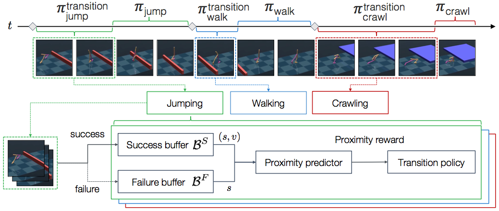

# Composing Complex Skills by Learning Transition Policies

## Descriptions
This project is a TensorFlow implementation of [**Composing Complex Skills by Learning Transition Policies**](https://youngwoon.github.io/transition/), published in [ICLR 2019](https://openreview.net/forum?id=rygrBhC5tQ). We provide code for our models, environments, and baselines presented in the paper.

Humans acquire complex skills by exploiting previously learned skills and making transitions between them. To empower machines with this ability, we propose a method that can learn transition policies which effectively connect primitive skills to perform sequential tasks without handcrafted rewards. To efficiently train our transition policies, we introduce proximity predictors which induce rewards gauging proximity to suitable initial states for the next skill.

<p align="center">
​    
</p>

The proposed method is evaluated on a set of complex continuous control tasks in bipedal locomotion and robotic arm manipulation which traditional policy gradient methods struggle at. We demonstrate that transition policies enable us to effectively compose complex skills with existing primitive skills. The proposed induced rewards computed using the proximity predictor further improve training efficiency by providing more dense information than the sparse rewards from the environments.

<p align="center">
​    
</p>


## Directories
The structure of the repository:
- **./rl**: models, training, and evalution scripts
- **./gym**: manipulation and locomotion environment code in MuJoCo (modified from OpenAI gym)
- **./baselines**: contains common utilities from OpenAI baselines

## Prerequisites

- Python 3.6
- [tmux](https://github.com/tmux/tmux)
- [Tensorflow 1.13.0](https://github.com/tensorflow/tensorflow/tree/r1.0)
- [SciPy](http://www.scipy.org/install.html)
- [NumPy](http://www.numpy.org/)
- [MuJoCo 1.50.1.68](http://www.mujoco.org/)

## MuJoCo environment
- All environments are located in `transition/gym/envs/mujoco`.
- Code for Manipulation (Jaco) and Locomotion (Walker2d) environments uses MuJoCo.

## Usage

### Training
All training code is located in `transition/rl`.
In the `transition/` folder run `run.py`.
Example scripts can be found in `run_jaco.sh`, `run_jaco_primitives.sh`, `run_walker.sh`, `run_walker_primitives.sh`.

#### Training for primitive skills
- Train policices to acquire primitive skills
```
python3 run.py --mpi 4 --prefix toss_ICLR2019 --env JacoToss-v1 --hrl False --num_rollouts 10000  # Jaco Toss env
python3 run.py --mpi 4 --prefix hit_ICLR2019 --env JacoHit-v1 --hrl False --num_rollouts 10000    # Jaco Hit up env
```
Environments for primitive skills: `JacoPick`, `JacoCatch`, `JacoToss`, `JacoHit`, `Walker2dForward`, `Walker2dBackward`, `Walker2dBalance`, `Walker2dJump`, `Walker2dCrawl`.

- Collect states in initiation sets for proximity predictors
```
python3 -m rl.main --prefix toss_ICLR2019 --env JacoToss-v1 --hrl False --num_rollouts 10000 --is_collect_state True --num_evaluation_run 1000 # Jaco Toss env
python3 -m rl.main --prefix hit_ICLR2019 --env JacoHit-v1 --hrl False --num_rollouts 10000 --is_collect_state True --num_evaluation_run 1000 # Jaco Hit env
```

#### Training for complex skills (i.e. for the Jaco arm to toss and hit a ball utilizing Toss and Hit primitives)
- Train our model (transition + proximity reward) on a complex task
```
python3 run.py --mpi 4 --prefix serve_ours_ICLR2019 --env JacoServe-v1 --num_rollouts 10000 --primitive_dir primitive_iclr --primitive_envs JacoToss-v1,JacoHit-v1 --primitive_paths JacoToss.toss_ICLR2019,JacoHit.hit_ICLR2019
```
- Train without hierarchical reinforcement learning (just policy gradient)
```
python3 run.py --mpi 4 --prefix serve_trpo_ICLR2019 --env JacoServe-v1 --num_rollouts 10000 --hrl False --rl_method trpo
python3 run.py --mpi 4 --prefix serve_ppo_ICLR2019 --env JacoServe-v1 --num_rollouts 10000 --hrl False --rl_method ppo --optim_stepsize 3e-4
```
- Train without transition
```
python3 run.py --mpi 4 --prefix serve_no_trans_ICLR2019 --env JacoServe-v1 --num_rollouts 10000 --primitive_dir primitive_iclr --primitive_envs JacoToss-v1,JacoHit-v1 --primitive_paths JacoToss.toss_ICLR2019,JacoHit.hit_ICLR2019 --use_trans False
```
- Transition + task rewards
```
python3 run.py --mpi 4 --prefix serve_task_ICLR2019 --env JacoServe-v1 --num_rollouts 10000 --primitive_dir primitive_iclr --primitive_envs JacoToss-v1,JacoHit-v1 --primitive_paths JacoToss.toss_ICLR2019,JacoHit.hit_ICLR2019 --use_proximity_predictor False --env_args sparse_reward-1
```
- Transition + sparse proximity reward
```
python3 run.py --mpi 4 --prefix serve_sparse_ICLR2019 --env JacoServe-v1 --num_rollouts 10000 --primitive_dir primitive_iclr --primitive_envs JacoToss-v1,JacoHit-v1 --primitive_paths JacoToss.toss_ICLR2019,JacoHit.hit_ICLR2019 --proximity_dense_diff_rew False
```

- Arguments
   - `--hrl`: set to `False` to train a primitive policy or `True` to train transition policies for a complex task
   - `--render`: set to `True` to render videos
   - `--debug`: set to `True` to see debugging info
   - `--record`: set to `True` to record video in a folder
   - `--prefix`: a name for training
   - Environment
      - `--env`: specify which environment to use (Walker2dForward-v1, Walker2dHurdle-v1, env names in `gym/gym/envs/__init__.py`)
      - `--env_args`: (optional) arguments for env

   - Training
      - `--primitive_envs`: Separated list of primitive envs eg: JacoToss-v1,JacoHit-v1
      - `--primitive_paths`: Separated list of primitive model names inside `primitive_dir` loaded in order with primitive_envs
   - Hyperparameters
      - `--num_rollouts`: the number of rollouts
      - `--mpi`: number of environments run in parallel
      - `--proximity_use_traj_portion`: portion of collected trajectory rollout that the proximity predictor trains on

Environments for complex skills: `JacoKeepPick`, `JacoKeepCatch`, `JacoServe`, `Walker2dPatrol`, `Walker2dHurdle`, `Walker2dObstacleCourse`.

### Testing
- Evalute trained models
```
python3 -m rl.main --prefix toss_ICLR2019 --env JacoToss-v1 --num_rollouts 10000 --hrl False --is_train Falsee --record True # Jaco Toss env
python3 -m rl.main --prefix serve_ours_ICLR2019 --env JacoServe-v1 --primitive_dir primitive_iclr --primitive_envs JacoToss-v1,JacoHit-v1 --primitive_paths JacoToss.toss_ICLR2019,JacoHit.hit_ICLR2019 --is_train False --record True # Jaco Serve env
```
Check out `eval_cmd.txt` in the log directory for the exact evaluation command.

### Add you own environments
New environments can be added to train primitive and transition policies on chosen tasks. Create a gym environment and add environment in `gym/envs` and register the gym environment in `gym/envs/__init__.py`.

To train our method with the transition policy on complex tasks, the environment should provide a meta-controller signal for what primitive should be utilized. For the MuJoCo environments, the `get_next_primitive` function returns the skill to be used in a hierarchical task. Also, environments for primitive tasks require the `is_terminate` function which returns whether the primitive skill execution succeeds or not.
The environment should implement a step function which returns the observation, reward, done, and info. The environment should return the success signal as the reward.

### Locomotion
- Walker2dForward-v1
- Walker2dBackward-v1
- Walker2dBalance-v1
- Walker2dCrawl-v1
- Walker2dJump-v1
- Walker2dPatrol-v1: forward and backward
- Walker2dHurdle-v1: forward and jump
- Walker2dObstacleCourse-v1: forward, jump, and crawl

### Manipulation
- JacoPick-v1
- JacoCatch-v1
- JacoToss-v1
- JacoHit-v1
- JacoKeepPick-v1: pick up a box five times
- JacoKeepCatch-v1: catch a box five times
- JacoServe-v1: toss a ball and hit toward a target

## Troubleshooting

### Installation

1. Copy the [Mujoco version 1.5](https://www.roboti.us/index.html) and its license key to `~/.mujoco`
2. Add the following `PATH` into `~/.bashrc` or `~/.zshrc`

```bash
export MUJOCO_PY_MJKEY_PATH=/home/USER_NAME/.mujoco/mjkey.txt
export LD_LIBRARY_PATH=$LD_LIBRARY_PATH:/home/USER_NAME/.mujoco/mjpro150/bin:/usr/bin/nvidia-384
export LD_PRELOAD=/usr/lib/x86_64-linux-gnu/libGLEW.so:/usr/lib/nvidia-384/libGL.so
```

3. Make a virtual environment with Python 3.5.2 or 3.6.3 (do not use `anaconda` due to its compatibility with opencv and moviepy)
4. Install packages in the following `Dependencies` section

### Dependencies

```bash
# brew install open-mpi  # for mac OSX
$ sudo apt-get install python3-tk tmux patchelf libglew-dev libglfw3-dev
$ pip install tensorflow==1.13.0 # cpu is faster than gpu
$ pip install pillow moviepy tqdm ipdb scipy opencv-python mpi4py matplotlib h5py requests
# run imageio.plugins.ffmpeg.download() in python
$ python
>>> import imageio; imageio.plugins.ffmpeg.download()
# for mujoco-py==1.50.1.68
$ pip install mujoco-py==1.50.1.68
```

### Virtual screen for a headless server
```bash
sudo apt-get install xserver-xorg libglu1-mesa-dev freeglut3-dev mesa-common-dev libxmu-dev libxi-dev
# configure nvidia-x
sudo nvidia-xconfig -a --use-display-device=None --virtual=1280x1024
# run virtual screen
sudo /usr/bin/X :0
# run progrma with DISPLAY=:0
DISPLAY=:0 <program>
```

### GLEW initialization error: Missing GL version
```
export LD_PRELOAD=/usr/lib/x86_64-linux-gnu/libGLEW.so
```
Reference: https://github.com/openai/mujoco-py/issues/268


## Cite the paper
If you find this useful, please cite
```
@inproceedings{lee2018composing,
    title={Composing Complex Skills by Learning Transition Policies},
    author={Youngwoon Lee and Shao-Hua Sun and Sriram Somasundaram and Edward S. Hu and Joseph J. Lim},
    booktitle={International Conference on Learning Representations},
    year={2019},
    url={https://openreview.net/forum?id=rygrBhC5tQ},
}
```

## Authors
[Youngwoon Lee](http://youngwoon.github.io/)\*, [Shao-Hua Sun](http://shaohua0116.github.io/)\*, [Sriram Somasundaram](http://srirams32.github.io/), [Edward S. Hu](https://edwardshu.com/), and [Joseph J. Lim](http://www-bcf.usc.edu/~limjj/)

(\*Equal contribution)
